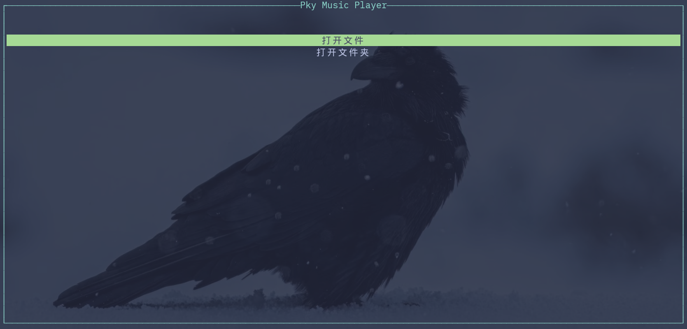
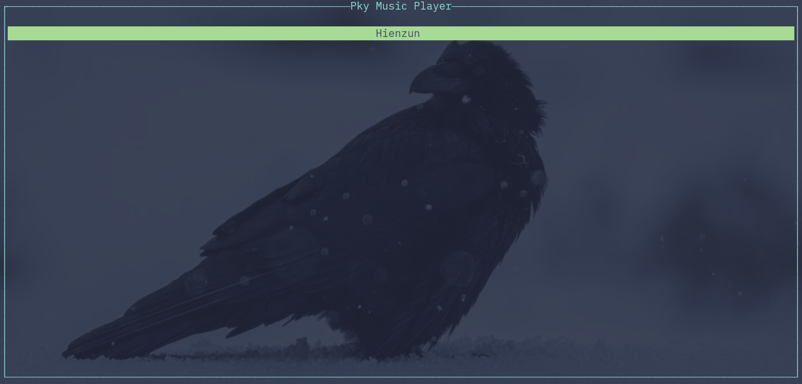
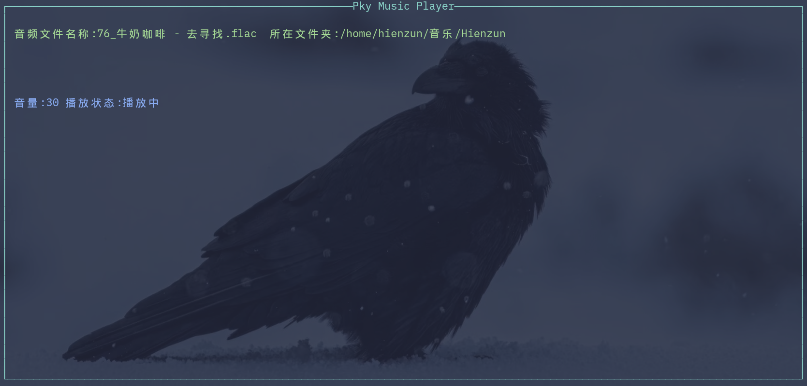

# 支持 x86 Windows、x86 Linux、loongarch64 Linux

# PkyMusic
这是一个基于 Rust 中的 Rodio 音频库和 Ratatui 终端 UI 库开发的简易CLI命令行音频播放器

## 介绍
这个项目是作为 Rust 初学者的我开发的第一个小项目，虽然功能受限，但勉强可以使用

## 功能
1. 播放本地音频文件或识别指定文件夹内所有音频文件并顺序播放

2. 支持暂停、调节音量

## 使用说明
1. 首先确保你已经拥有 Rust 环境,并获取了本项目

2. 运行方法

如果你获取的是源码，那么在项目根目录下打开终端，输入以下命令
```bash  
cargo run 
```
如果你获取的是本项目的发行版，那么在可执行文件所在的目录下打开终端，输入以下命令
```bash
./文件名
```
若没能运行成功，可能是文件没有运行权限,请输入以下命令后再尝试运行
```bash
chmod +x 文件名
```

3. 接下来可以选择打开文件或打开文件夹两个选项



4. 接下来会有简单的文件浏览功能

打开文件选项运行效果:



这是一个简单的文件浏览

默认的当前目录是你的音乐文件夹,如我的路径 /home/hienzun/音乐 下有一个名为 Hienzun 的文件夹

这里的交互逻辑很简单:

Backspace(上一级目录),Enter(下一级目录或播放符合要求的文件),ESC(退回到选择界面)

注意:如果你选择的选项是打开文件夹，那么你看到的界面依然是文件浏览，不过打开文件夹需要按"o"键，其余交互按键不变

5. 不出意外，音乐应该播放成功了！



这里的交互逻辑也很简单:

Space(暂停/继续),PgUp(上一首),PgDn(下一首),Up(提高音量),Down(降低音量),Esc(退回到选择界面)

### x86架构版本可能会遇到的问题(以 Fedora Linux 43 为例)
1. 依赖缺失

请输入以下命令
```bash
sudo dnf install alsa-lib-devel
```

2. 其他bug

我会努力完善和修复:)

### loongarch(龙芯)架构版本可能会遇到的问题(以 Loongnix 25 为例)
1. 依赖缺失

请输入以下命令
```bash
sudo apt update && sudo apt install libasound2-dev gcc
```

2. 运行成功但播放音乐时报错

请尝试输入以下命令
```bash
sudo apt install pipewire pipewire-alsa pipewire-pulse

#安装完毕后重启音频服务
systemctl --user restart pipewire pipewire-pulse
```

3. 其他bug

我会努力完善和修复:)
